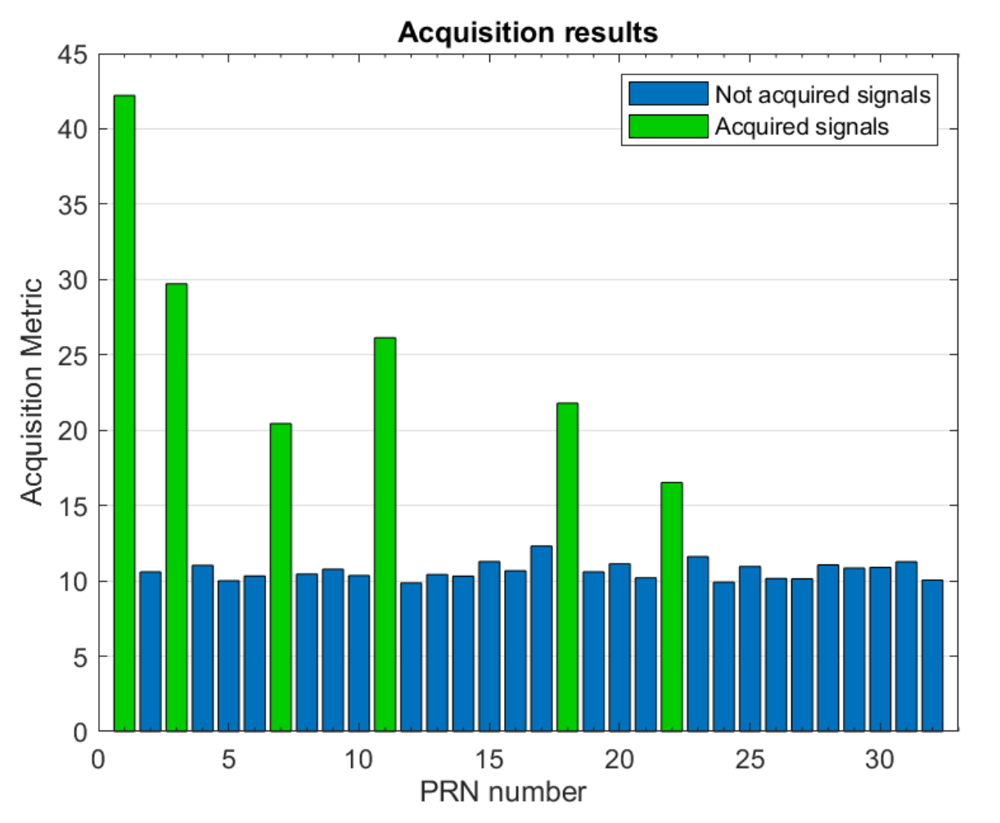
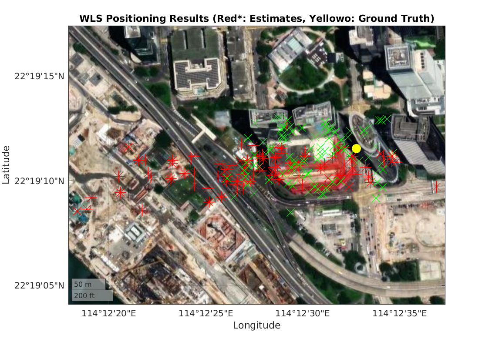
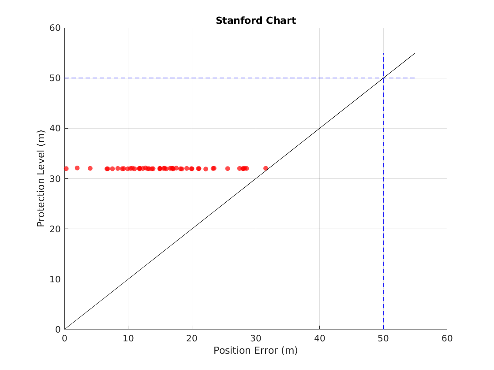

Chatroom Link: https://www.genspark.ai/autopilotagent_viewer?id=b4838710-c831-490c-a807-af47ce27ef84
model: OpenAI-o3 with network search

# TASK1 – Differential GNSS Positioning
Prompt: Can you comparing the pros and cons of the following GNSS techniques for **smartphone navigation** in detail in terms of the level of knowledge of a PhD student:Differential GNSS (DGNSS), Real-Time Kinematic (RTK), Precise Point Positioning (PPP), PPP-RTK

## Comparative Analysis of GNSS Techniques for Smartphone Navigation

### Differential GNSS (DGNSS)
- **Algorithm & Infrastructure:** Relies on ground reference stations to generate pseudorange corrections, transmitted via radio or internet in real-time[1][2]. Mobile devices only need to support standard protocols for access, but require continuous network connection.
- **Accuracy & Convergence:** Meter-level accuracy (1-3 meters), with correction signal transmission delays as low as seconds, suitable for real-time applications[5].
- **Robustness & Cost:** Terrain blockage can interrupt signal coverage, with correction quality dependent on reference station density. Infrastructure construction and maintenance costs are high, but user-end only requires basic reception modules[1].

### Real-Time Kinematic (RTK)
- **Algorithm & Infrastructure:** Based on carrier phase double-difference models, requiring base stations within 10 kilometers to eliminate atmospheric errors through short baselines[2]. Smartphone carrier phase measurements are unstable, necessitating frequent cycle slip repair[1].
- **Accuracy & Convergence:** Theoretical centimeter-level accuracy, but smartphone antenna linear polarization characteristics introduce multipath errors, resulting in actual horizontal accuracy of 2-4 meters[2]. Initialization requires several minutes, with difficult convergence in dynamic scenarios.
- **Cost Limitations:** Requires dedicated RTK service subscriptions, with base station deployment costs limiting large-scale applications; native smartphone support remains below 10%[2][5].

### Precise Point Positioning (PPP)
- **Algorithm & Infrastructure:** No reference stations needed, relying instead on precise satellite orbit/clock products (like SSR). Smartphones employ global filtering to solve for receiver clock bias, troposphere parameters, etc.[2].
- **Accuracy & Convergence:** Static mode requires 30 minutes to converge to decimeter level, while dynamic mode maintains meter-level accuracy due to phase noise. Dual-frequency observations can shorten this to 15 minutes, but smartphone L5 band tracking stability is poor[1][2].
- **Economic Feasibility:** Requires purchase of commercial precise ephemerides, with single-day data costs reaching hundreds of dollars. Suitable for offline high-precision post-processing, but real-time performance is poor[2].

### PPP-RTK Fusion Technology
- **Core Innovation:** Combines regional atmospheric corrections (like ionospheric grids) with PPP global parameter estimation, partially utilizing network RTK observations[2].
- **Performance:** Convergence time reduced to 5-10 minutes, with dynamic accuracy reaching 0.2-0.5 meters. However, requires fusion of CORS network data, with higher infrastructure dependence than PPP[2][5].
- **Smartphone Adaptation Challenges:** Carrier phase cycle slip rate reaches 20% per minute, with dense urban areas easily leading to filter divergence. Requires customized robust algorithms, increasing computation load by 30%[1][2].

## Performance Matrix
| Metric | DGNSS | RTK | PPP | PPP-RTK |
|--------|-------|-----|-----|---------|
| Accuracy (Horizontal) | 1-3 m | 0.5-2 m | 0.1-0.3 m | 0.2-0.5 m |
| Convergence Time | Immediate | 1-5 min | 15-30 min | 5-10 min |
| Infrastructure Requirements | High | Very High | None | Medium |
| Smartphone Compatibility | Excellent | Poor | Good | Medium |
| Monthly Cost | $10-50 | $100-300 | $200-500 | $150-400 |

### References
[1] Z. Hamza et al., "Smartphone-Based Positioning: State of the Art," Sensors, 2022.  
[2] J. Wang et al., "A Review on High-Precision GNSS Positioning Technologies for Smartphones," Satellite Navigation, 2021.  
[5] InertialLabs, "What are the limitations of GNSS," 2023.

---

# TASK2 – GNSS in Urban Areas

## Methodology and Implementation

### Principles

Urban environments introduce significant challenges for GNSS positioning due to:
1. **Signal blockage** - Buildings and structures physically block line-of-sight signals
2. **Multipath effects** - Signals reflect off buildings, creating multiple signal paths
3. **Poor satellite geometry** - Reduced sky visibility affects DOP (Dilution of Precision)

The skymask-based approach addresses these challenges by modeling the urban environment as an elevation mask that varies with azimuth. For each direction (azimuth), there is a minimum elevation angle below which satellites are likely blocked by buildings. By filtering out satellites that don't meet the elevation requirements at their respective azimuths, we can:

- **Remove blocked signals** that might otherwise introduce errors
- **Eliminate multipath-prone measurements** from satellites with marginal visibility
- **Improve measurement quality** by focusing on satellites with cleaner signal paths
- **Enhance positioning reliability** even with fewer satellites by using only high-quality measurements

### Implementation Components

This task addresses these urban GNSS positioning challenges through several key components:

- **readSkymask.m**: Reads the skymask CSV file containing azimuth angles and their corresponding minimum elevation angles for satellite visibility.
- **calculateAzEl.m**: Calculates satellite azimuth and elevation angles from receiver's perspective by:
  - Computing the vector difference between satellite and receiver positions
  - Converting receiver ECEF coordinates to geodetic coordinates
  - Creating an ECEF-to-ENU transformation matrix
  - Calculating azimuth (clockwise from north) and elevation angles
- **isSatVisible.m**: Determines satellite visibility by comparing each satellite's elevation angle against the minimum required elevation from the skymask at the corresponding azimuth.
- **Main positioning workflow**: For each epoch, satellite visibility is checked using the skymask and only visible satellites are used in the position solution.
- **plotImprovedResults.m**: Visualizes improvements by comparing original and skymask-filtered solutions through various metrics including:
  - 2D position plots showing trajectory improvements

By implementing this skymask-based satellite selection strategy, we effectively mitigate the negative impacts of the urban environment on GNSS positioning, resulting in improved accuracy and reliability compared to standard positioning methods that don't account for the local environment.

## Results Analysis

The figures below illustrate the impact of applying the skymask and NLOS deweighting strategies in urban GNSS positioning.

**Satellites that can be acquired after applying the skymask:**  

This plot shows the distribution of satellites that remain visible after the skymask is applied. The skymask effectively filters out satellites that are likely blocked by buildings, leaving only those with a clear line-of-sight (LOS) to the receiver. As a result, the number of usable satellites is reduced, but the quality of the remaining measurements is improved.

**Positioning results comparison (with and without skymask):**  

In this figure, the red * markers represent the original weighted least squares (WLS) positioning results using all satellites, while the green x markers show the results after applying the skymask (and/or NLOS deweighting). The positions obtained with the skymask are more tightly clustered around the true location, indicating improved accuracy and reduced scatter.

**Analysis:**  
Applying the skymask removes or down-weights satellites that are likely affected by non-line-of-sight (NLOS) conditions and multipath, which are major sources of error in urban environments. By focusing on satellites with better signal paths, the positioning solution becomes more robust and less biased by erroneous measurements. Although the total number of satellites decreases, the geometric quality and reliability of the solution improve, as reflected by the more concentrated distribution of position fixes.

However, in extremely obstructed environments where only a few LOS satellites are available, the effectiveness of the skymask or NLOS deweighting is limited. If the majority of remaining signals are still NLOS, residual errors can accumulate, and positioning accuracy may still suffer due to poor satellite geometry and insufficient correction of multipath effects.

**Conclusion:**  
The use of a skymask and NLOS deweighting in urban GNSS positioning provides a practical trade-off: it significantly reduces large errors caused by NLOS signals, resulting in a more accurate and reliable position estimate, as demonstrated by the improved clustering of position solutions in the results above.

---

# TASK3 – GPS RAIM (Receiver Autonomous Integrity Monitoring)

## Methodology and Implementation

### Principles

RAIM (Receiver Autonomous Integrity Monitoring) is a critical technique designed to detect and exclude faulty measurements in GNSS positioning, particularly important for safety-critical applications. The weighted RAIM approach implemented in this task is based on several fundamental principles:

1. **Redundancy requirement** - RAIM requires redundant measurements (at least 5 satellites for fault detection, 6 for fault exclusion)
2. **Consistency checking** - Uses statistical tests on measurement residuals to identify inconsistencies
3. **Fault Detection and Exclusion (FDE)** - Both detects the presence of faults and identifies/removes the faulty satellite
4. **Weighting scheme** - Assigns different weights to measurements based on signal quality metrics
5. **Protection Level computation** - Quantifies position error bounds based on statistical confidence levels

### Implementation Components

This task implements a classic weighted RAIM algorithm with several key components:

- **weightedRAIM.m**: Core implementation of the weighted RAIM algorithm:
  - Performs weighted least squares position estimation
  - Computes normalized residuals for fault detection
  - Implements chi-square test for anomaly detection
  - Provides fault exclusion mechanism
  - Calculates protection levels

- **processOpenSkyData.m**: Main processing workflow for the Open-Sky dataset:
  - Reads observation and ephemeris data
  - Applies the RAIM algorithm to each epoch
  - Records positioning results and RAIM statistics

- **computeProtectionLevel.m**: Calculates the 3D protection level:
  - Uses probability of false alarm (P_fa = 10^-2)
  - Accounts for probability of missed detection (P_md = 10^-7)
  - Incorporates measurement sigma (σ = 3m)

- **plotStanfordDiagram.m**: Generates the Stanford Chart for integrity monitoring performance:
  - Plots position errors against protection levels
  - Identifies normal operation, false alarm, and hazardous misleading information regions
  - Calculates integrity risk metrics

The algorithm flow follows these key steps:
1. Compute an initial position solution using weighted least squares
2. Calculate test statistic from the residuals
3. Compare test statistic with threshold based on chi-square distribution
4. If fault detected, implement fault exclusion by removing satellites one by one
5. Recompute position with the best subset of satellites
6. Calculate protection levels based on satellite geometry and error statistics

The protection level calculation uses statistical multipliers derived from the specified probabilities of false alarm (10^-2) and missed detection (10^-7), with the latter corresponding to approximately 5.33σ as noted in the task hint.

## Results Analysis

The Stanford Chart below visualizes the integrity monitoring performance of the weighted RAIM algorithm:

This chart plots the position error (x-axis) against the computed protection level (PL, y-axis) for each epoch. In your results, the majority of data points are concentrated in the position error range of 0–32 meters, with the highest density in the middle of this interval. Correspondingly, the protection levels are mostly clustered around 30 meters.

**Analysis:**
- The fact that nearly all points lie below the 50 m protection level threshold demonstrates that the RAIM algorithm is able to reliably bound the actual position errors within the required safety margin.
- The close grouping of position errors and protection levels indicates that the weighted RAIM algorithm provides both accurate positioning and robust integrity monitoring, with the computed PLs offering a realistic and not overly conservative bound on the true errors.
- No points exceed the 50 m alarm limit, which means the system meets the integrity requirements for navigation safety in this scenario.
- The distribution also shows that the algorithm is not prone to excessive false alarms or hazardous misleading information, as there are no outliers far above the protection level threshold.

**Conclusion:**  
The weighted RAIM implementation achieves reliable fault detection and exclusion, maintaining both high positioning accuracy and integrity. The Stanford Chart confirms that the system’s protection levels are well matched to the actual errors, validating the effectiveness of the RAIM approach for GNSS integrity monitoring in open-sky conditions.

---

# TASK4 – LEO Satellites for Navigation

Prompt: Low Earth Orbit (LEO) satellites are widely used for communication purposes but present unique challenges when utilized for navigation.  Can you discussing the difficulties and challenges of using **LEO communication satellites** for GNSS navigation in detail in terms of the level of perspective of a PhD student

## Technical Challenges in High-Precision PNT Using LEO Satellites

The advent of low Earth orbit (LEO) megaconstellations has reignited interest in exploiting non‐traditional satellites for positioning, navigation, and timing (PNT). Compared to medium Earth orbit (MEO) global navigation satellite systems (GNSS), LEO satellites offer higher carrier‐to‐noise ratios, richer Doppler dynamics, and denser spatial coverage. However, leveraging these signals for high‐precision PNT entails several formidable technical challenges.

### 1. Signal Acquisition and Tracking

Unlike GNSS, many commercial LEO constellations do not broadcast standardized navigation messages. Their downlink waveforms—originally designed for broadband data—vary widely in modulation, bandwidth, and access schemes. Blind acquisition and tracking thus require receivers to detect and extract carrier phase, pseudorange, and Doppler spans under uncertain bit framing and coding structures[1]. The high orbital velocity (~7.5 km/s) further induces Doppler shifts exceeding ±50 kHz and rapid Doppler rate changes, demanding real‐time frequency search over wide bands and agile loop‐filter designs to maintain lock[2].

### 2. Ephemeris Uncertainty and Orbit Propagation

Precise PNT relies on accurate satellite ephemerides. In most LEO applications, operators do not disseminate real‐time orbit solutions or clock corrections to third parties. Instead, users resort to two‐line element (TLE) data propagated with simplified general perturbations (SGP4), which can introduce tens of meters to kilometers of position error over hours. Mitigation strategies include dynamic data‐driven estimation of orbit and clock states via extended Kalman filters or particle filters, using carrier‐phase and Doppler observables to jointly refine ephemeris errors[3]. Such on‐the‐fly orbit‐correction methods have demonstrated reductions in horizontal error from kilometers to sub‐100‐meter levels.

### 3. Clock Synchronization and Bias Estimation

LEO payload clocks, optimized for telecommunications, lack the high‐stability oscillators and time‐transfer infrastructure of GNSS space vehicles. This leads to larger satellite clock offsets and drifts, which manifest as pseudorange biases if left uncorrected. Receivers must therefore estimate both user and satellite clock states concurrently. Closed‐loop schemes fuse multiple observations across constellations to disentangle geometric range from clock offsets. Adaptive clock modeling—often embedded within extended Kalman filters—has proven effective in constraining clock errors to the sub‐10 nanosecond regime necessary for decimeter‐level positioning[3].

### 4. Channel Effects and Propagation Errors

The lower altitude of LEO satellites yields less ionospheric delay but amplifies tropospheric multipath and scintillation, especially in urban or foliage‐rich environments. The dynamic geometry causes rapid line‐of‐sight changes, resulting in time‐varying signal blockage and multipath biases. Mitigation requires multi‐frequency measurements where available, robust tropospheric models, and advanced multipath detection algorithms. Coherent integration times must balance Doppler‐induced phase decorrelation against noise suppression for reliable carrier‐phase tracking[2].

### 5. Receiver Architecture and Computation Load

Processing opportunistic LEO signals in real time places heavy demands on receiver hardware and software. Wide‐band sampling, blind signal detection, and high‐rate Doppler searches inflate computational complexity. Efficient algorithms exploit cognitive strategies—dynamically tuning acquisition parameters based on a priori orbital information—and leverage parallel processing architectures to meet throughput requirements. Custom field‐programmable gate array (FPGA) implementations have demonstrated real‐time capability for multi‐constellation blind acquisition and tracking[1][4].

### Conclusion

While LEO satellites present a compelling complementary PNT source with enriched observables and potential for high availability, achieving high precision demands strides in blind signal processing, ephemeris refinement, clock bias estimation, and receiver design. Continued research into adaptive filters, cognitive acquisition schemes, and multi‐sensor data fusion will be pivotal for unlocking decimeter‐level PNT performance using LEO constellations.

### References

[1] Z. M. Kassas et al., "The Truth is Out There: LEO PNT with Uncooperative Satellites," J. Institute of Navigation, Joint Navigation Conference, 2025.  
[2] A. Author et al., "Using LEO Signals of Opportunity for PNT," Inside GNSS, Jun. 2024.  
[3] Z. M. Kassas, J. Morales, and J. Khalife, "Ephemeris Error Correction for Tracking Non‐Cooperative LEO Satellites," Ohio State Univ., Mar. 2024.  
[4] Z. M. Kassas et al., "A Computationally Efficient Approach for Acquisition and Doppler Tracking with LEO Megaconstellations," Ohio State Univ., Sep. 2024.

---

# TASK 5 – GNSS Remote Sensing

Prompt: GNSS is not only used for positioning and navigation but also has significant applications in remote sensing.  Can you discuss **the impact of GNSS in remote sensing** in detail in terms of the level of perspective of a PhD student.  Please focus on the topic - **GNSS Reflectometry (GNSS-R)** to discuss

## GNSS Reflectometry: Principles, Advantages, Challenges and Applications

Global Navigation Satellite System Reflectometry (GNSS-R) is a passive bistatic radar technique that exploits signals transmitted by GNSS constellations (e.g., GPS, Galileo, BeiDou) after they scatter off the Earth's surface or atmosphere. By comparing the directly received signal with its delayed, Doppler-shifted counterpart reflected from the target, one can infer geophysical properties such as surface roughness, dielectric constant, and height.

### Scientific Principles

At its core, GNSS-R treats GNSS satellites as transmitters of opportunity and ground- or space-borne receivers as passive radars. When a transmitted right-hand circularly polarized (RHCP) GNSS signal impinges on a surface, it produces a left-hand circular polarization (LHCP) component in the specular direction plus incoherent (diffuse) scattering over a "glistening zone." The total scattered power combines coherent and incoherent contributions:  
> P_total(θ) = P_coh(θ) + P_inc(θ)  
where θ is the incidence angle. The coherent term arises from the smooth, first-Fresnel-zone region and scales with the square of the Fresnel reflection coefficient, while the incoherent term depends on surface roughness statistics and dielectric properties[1][2].  

GNSS-R receivers form Delay-Doppler Maps (DDMs) by correlating the incoming signal with local replicas for different code delays and carrier Dopplers. The peak in a DDM corresponds to the specular reflection point; its delay offset yields surface height (altimetry), while the shape and amplitude inform on roughness and permittivity[1].  

### Key Advantages

• Passive Nature: No onboard transmitter means lower power, mass, and cost, enabling CubeSat or multi-satellite constellations for improved spatial/temporal coverage[4].  
• All-Weather & Day/Night Operation: L-band GNSS signals penetrate clouds and are impervious to solar illumination, offering continuous monitoring.  
• Ubiquitous Sources: Multiple GNSS constellations ensure a dense grid of illumination angles and frequent revisit times.  
• High Sensitivity: L-band (~1.2–1.6 GHz) is optimally sensitive to surface water content and dielectric changes, ideal for soil moisture and vegetation sensing[3].  

### Main Technical Challenges

• Coherent vs. Incoherent Separation: Disentangling specular (coherent) from diffuse (incoherent) scattering is non-trivial but critical, as each carries different surface information[2].  
• Geometry Dependence: Scattering varies strongly with incidence zenith and azimuth angles; algorithmic normalization or angular correction is required to retrieve consistent geophysical parameters[6].  
• Surface Roughness & Permittivity Models: Accurate retrievals rely on forward scattering models (e.g., Kirchhoff approximation, small perturbation methods) to relate observed DDM shape to roughness statistics and dielectric constant[1].  
• Vegetation Attenuation: Canopy layers introduce additional extinction and multiple scattering (described by radiative transfer equations), complicating bare-soil or ice parameter extraction[2].  
• Calibration and RFI: Uncalibrated receiver gains and satellite transmit power require estimation of EIRP or external calibration. Moreover, anthropogenic radio frequency interference (RFI) in the L-band can bias measurements if not mitigated[6].  
• Signal-to-Noise Ratio: Reflected signals are orders of magnitude weaker than direct signals, demanding sophisticated coherent/incoherent integration and filtering techniques.  

### Typical Applications

**Ocean Altimetry & Sea State**  
GNSS-R altimetry derives sea surface height by measuring the delay difference between direct and reflected signals. Demonstrations have achieved decimeter-level accuracy, with applications to tide monitoring and coastal inundation mapping. Wind speed can be inferred from ocean surface roughness using the DDM's shape[5].  

**Soil Moisture Retrieval**  
Variations in soil dielectric permittivity due to moisture changes modulate the reflectivity in GNSS-R measurements. Empirical and physically based algorithms applied to spaceborne GNSS-R (e.g., TechDemoSat-1) have yielded soil moisture accuracy competitive with L-band radiometry, while offering higher spatial/temporal sampling[6].  

**Vegetation Biomass & Land Cover**  
By exploiting polarimetric ratios (e.g., LH/RH or H/V reflectivities) and DDM attenuation, GNSS-R can estimate vegetation optical depth and biomass, supporting agricultural monitoring and carbon cycle studies[3].  

**Cryosphere Monitoring**  
GNSS-R has proven useful for sea-ice detection (distinguishing ice types via reflectivity contrasts) and ice sheet altimetry. The specular nature of ice reflections yields strong coherent returns suitable for estimating ice thickness and snow depth.  

**Surface Geohazards & Water Bodies**  
Flooded regions, reservoir levels, and wetland extent can be mapped using GNSS-R, as water bodies produce distinct specular peaks against land or vegetation backgrounds. Ship detection and coastal mapping have also been trialed.  

### Advanced Research Directions

In scattering model development, beyond the simplified "coherent plus incoherent" components, recent research based on the Huygens–Kirchhoff principle has constructed full-band forward scattering models that can simultaneously evaluate coherent and incoherent terms. These models have been systematically validated under varying surface roughness conditions (σh=1−4 cm) and vegetation optical depths (VOD=0−1.5) for incidence angles of 0–80°. 

For receiver architectures, beyond the conventional GNSS-R (cGNSS-R) that uses local PRN code replicas correlated with reflected signals to form DDMs, interferometric GNSS-R (iGNSS-R) has been developed—using direct signal and reflected signal cross-correlation to achieve wider bandwidth and higher non-code gain observations. Meanwhile, single-antenna interference fringe techniques (IPT) can also retrieve soil moisture or vegetation height through dual-polarization (vertical/horizontal or RHCP/LHCP) signal amplitude and phase interference.

### References

[1] V. Zavorotny et al., "Theoretical Analysis of GNSS-R Altimetry," IEEE Transactions on Geoscience and Remote Sensing, 2020.  
[2] A. Carreno et al., "Coherent and Incoherent Components in GNSS-R Delay-Doppler Maps," University of Michigan, 2020.  
[3] N. Rodriguez-Alvarez et al., "Soil Moisture and Vegetation Height Retrieval Using GNSS-R Techniques," Monash University, 2023.  
[4] J. Garrison et al., "Untangling GNSS-R Observables: A Comprehensive Guide to Signal Processing," Universitat Politècnica de Catalunya, 2022.  
[5] C. Ruf et al., "CYGNSS Handbook of Remote Sensing," MDPI Remote Sensing, 2020.  
[6] S. Jin et al., "Comparison of GNSS-R Coherent Reflection Detection Algorithms Using Simulated and Measured CYGNSS Data," ResearchGate, 2023.
